# Hi, I'm Elaheh 👋

### Senior Data Scientist / ML Engineer

I'm a Senior Data Scientist / ML Engineer with 7+ years of experience designing and shipping
end-to-end machine learning systems — from data pipelines and retrieval models to production
agentic LLM applications. I hold a B.Sc. in Software Engineering and an M.Sc. in Artificial
Intelligence from [Amirkabir University of Technology](https://aut.ac.ir/), and I've built ML
systems at **Digikala**, **Snapp!**, **Asan Pardakht**, and **Nahal** spanning search &
retrieval, ETA prediction, recommendation systems, and — most recently — agentic LLM pipelines.
My research on deep ETA prediction for urban transport was published at
[IEEE Intelligent Vehicles Symposium 2022](https://arxiv.org/abs/2309.09830).

- 🔭 Recently building **agentic LLM systems** — RAG, LLM-as-judge evaluation, multi-agent
  pipelines with LangChain/LangGraph and Pydantic AI
- ⚙️ Comfortable end-to-end: **Python & Go**, PyTorch/TensorFlow, and MLOps tooling like
  Airflow, MLflow, and Kubeflow
- 📄 Full resume, always up to date: [elaheh-dastan.pdf](https://github.com/elaheh-dastan/elaheh-dastan.pdf/releases/latest)
- ✍️ I occasionally write on [Medium](https://elahe-dstn.medium.com)
- 🍭 Fun fact: I do love lollipop

## Tech Stack

